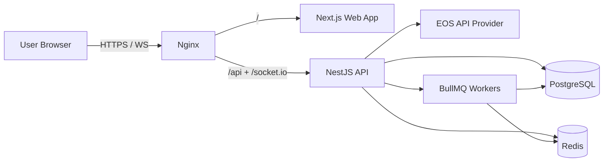

# Architecture Diagram

## Data Trust Rules

- Game outcomes are computed in API/worker processes only.
- Clients receive deterministic animation payloads and snapshots.
- No client-side RNG is trusted for outcome generation.
